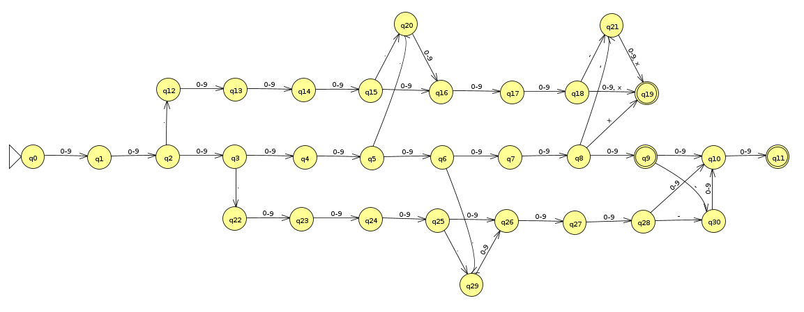

# 📚 CPF/RG Validator - Brazilian Document Validation

  
*Tokyo Night Theme (Dark & Light Modes)*

<div align="center">
  
  
  
  
</div>

## 🗂️ Table of Contents
- [⭐ Features](#-features)
- [📸 Screenshots](#-screenshots)
- [🏗️ Technical Implementation](#️-technical-implementation)
- [⚙️ Technologies](#️-technologies)
- [🚀 Getting Started](#-getting-started)
- [🧪 Testing](#-testing)
- [📜 License](#-license)
- [👥 Authors](#-authors)

---

## ⭐ Features
**Industrial-grade Brazilian document validation:**
- ✅ **Dual Validation Modes**
  - `Single Mode`: Real-time validation with instant feedback
  - `Batch Mode`: Process multiple documents (one per line)
- 🔍 **Two-Step Validation**
  - **Finite Automaton**: Format verification via DFA (5 RG patterns • 5 CPF patterns)
  - **Check Digit**: Mathematical validation using modulo 11
- 🎨 **Modern Interface**
  - Responsive design with Tailwind CSS
  - Smooth dark/light mode transitions

### 🔢 Accepted Formats
**Valid RG Patterns**  
`111111111` • `11.111.111-1` • `11111.111-1` • `11.11111-1` • `11111111-1`

**Valid CPF Patterns**  
`11111111111` • `111.111.111-11` • `111111.111-11` • `111.111111-11` • `111111111-11`

---

## 📸 Screenshots

### Automaton Diagram
  
*Finite State Machine with Transition Rules*
📥 [Download JFLAP Project File](./docs/jflap/automaton.jff)

<details>
  <summary>📊 Complete Transition Table (Enum-based States)</summary>

| State | 0-9      | x        | .        | -        |
|-------|----------|----------|----------|----------|
| → Q0  | Q1       | ❌       | ❌       | ❌       |
| Q1    | Q2       | ❌       | ❌       | ❌       |
| Q2    | Q3       | ❌       | Q12      | ❌       |
| Q3    | Q4       | ❌       | Q22      | ❌       |
| Q4    | Q5       | ❌       | ❌       | ❌       |
| Q5    | Q6       | ❌       | Q20      | ❌       |
| Q6    | Q7       | ❌       | Q29      | ❌       |
| Q7    | Q8       | ❌       | ❌       | ❌       |
| Q8    | Q9       | Q19      | ❌       | Q21      |
| Q9 *  | Q10      | ❌       | ❌       | Q30      |
| Q10   | Q11      | ❌       | ❌       | ❌       |
| Q11 * | ❌       | ❌       | ❌       | ❌       |
| Q12   | Q13      | ❌       | ❌       | ❌       |
| Q13   | Q14      | ❌       | ❌       | ❌       |
| Q14   | Q15      | ❌       | ❌       | ❌       |
| Q15   | Q16      | ❌       | Q20      | ❌       |
| Q16   | Q17      | ❌       | ❌       | ❌       |
| Q17   | Q18      | ❌       | ❌       | ❌       |
| Q18   | Q19      | Q19      | ❌       | Q21      |
| Q19 * | ❌       | ❌       | ❌       | ❌       |
| Q20   | Q16      | ❌       | ❌       | ❌       |
| Q21   | Q19      | Q19      | ❌       | ❌       |
| Q22   | Q23      | ❌       | ❌       | ❌       |
| Q23   | Q24      | ❌       | ❌       | ❌       |
| Q24   | Q25      | ❌       | ❌       | ❌       |
| Q25   | Q26      | ❌       | Q29      | ❌       |
| Q26   | Q27      | ❌       | ❌       | ❌       |
| Q27   | Q28      | ❌       | ❌       | ❌       |
| Q28   | Q10      | ❌       | ❌       | Q30      |
| Q29   | Q26      | ❌       | ❌       | ❌       |
| Q30   | Q10      | ❌       | ❌       | ❌       |

*(Implemented using Java Enums and HashMaps)*
</details>

### Single Validation Mode
  
*Single-document Text Input Validation*

### Batch Processing Mode
  
*Multi-document Text Input Validation*

---

## 🏗️ Technical Implementation

### Core Architecture
```bash
src/
├── main
│   ├── java/br/edu/fesa/validator
│   │   ├── ValidatorApplication.java       # Main class
│   │   ├── controller/DocumentController.java # REST endpoints
│   │   ├── model/DocumentResultModel.java  # Validation result DTO
│   │   ├── service/DocumentService.java    # Business logic
│   │   └── utils
│   │       ├── AFDValidator.java           # State machine implementation
│   │       └── CheckDigitValidator.java    # Digit calculation
│   └── resources
│       ├── templates/index.html            # Thymeleaf template
│       └── static/css/styles.css           # Tailwind styles
└── test
    └── java/br/edu/fesa/validator
        ├── service/DocumentServiceTest.java    # 13 Tests
        └── utils
            ├── AFDValidatorTest.java          # 13 Tests
            └── CheckDigitValidatorTest.java   # 12 Tests
```

---

## ⚙️ Technologies
- **Backend**: Spring Boot 3.4.2 + Java 17
- **Frontend**: Thymeleaf + Tailwind CSS
- **State Machine**: Enum-based DFA with HashMap transitions
- **Build**: Maven 3.9+
- **Testing**: JUnit 5 + Mockito (38 Total Tests)

---

## 🚀 Getting Started

### Prerequisites
- JDK 17
- Maven 3.9+

### Installation
```bash
git clone git@github.com:Rutpiv/cpf-rg-validator.git
cd cpf-rg-validator
mvn clean install
```

### Running the Application
```bash
mvn spring-boot:run
```
Access: 🌐 [http://localhost:8080](http://localhost:8080)

---

## 🧪 Testing
**Comprehensive validation coverage:**
```bash
mvn test
```
- ✅ 13 Service Tests (Business logic)
- ✅ 13 Automaton Tests (State transitions)
- ✅ 12 Check Digit Tests (Mathematical validation)

---

## 📜 License
Distributed under **[BSD 3-Clause License](./LICENSE)**.  
➡️ [View Full License Text](./LICENSE)

---

## 👥 Authors
Students from **Engenheiro Salvador Arena College**:  
➡️ [Complete Contributors List](./AUTHORS)

---

<div align="center">
  <sub>Built with ♥ by Computer Engineering students</sub><br>
  <sub>Compilers Course Project • 2025 Semester</sub>
</div>
